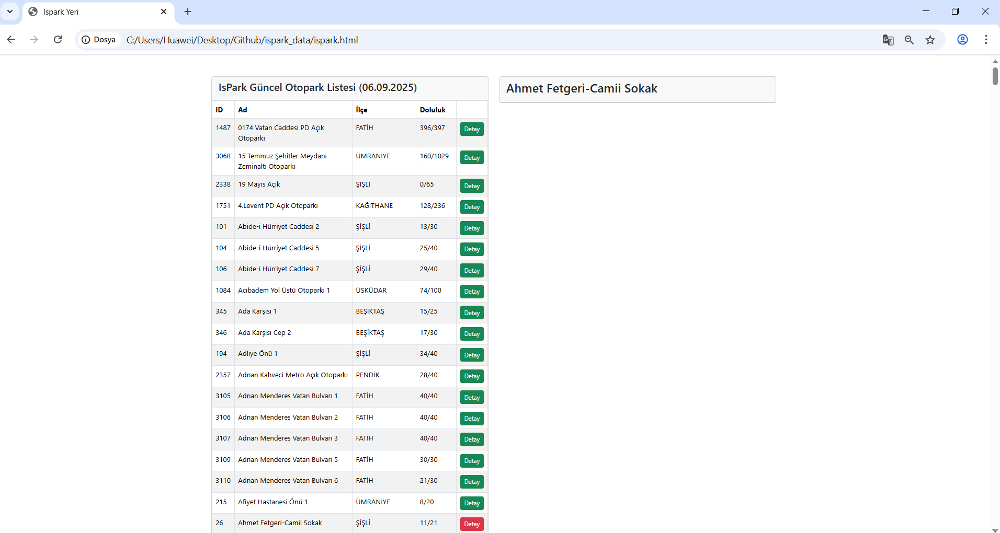

# İsPark Parking Tracker

A real-time parking availability web app using Istanbul's İsPark API.


## Features

- Real-time parking data from İsPark API
- Responsive Bootstrap 5 interface
- Interactive parking lot details
- Color-coded status indicators
- Custom styling with Font Awesome icons

## Tech Stack

- HTML5, CSS3, Vanilla JavaScript
- Bootstrap 5.3.5
- Font Awesome 6
- İsPark Public API

## Quick Start

1. Clone the repository:
```bash
git clone [your-repo-url]
```

2. Open `index.html` in your browser or serve locally:
```bash
python -m http.server 8000
# Navigate to http://localhost:8000
```

## API Endpoints

- **All Parks**: `https://api.ibb.gov.tr/ispark/Park`
- **Park Details**: `https://api.ibb.gov.tr/ispark/ParkDetay?id={parkId}`

## Custom Styles

```css
ul.check-list        /* Custom checklist with icons */
.btn-indigo          /* Custom indigo button */
```

## Data Structure

```javascript
{
  parkID: 1,
  parkName: "Park Name",
  district: "District",
  capacity: 100,
  emptyCapacity: 45,
  isOpen: true
}
```
---

**Data source**: İstanbul Metropolitan Municipality İsPark API
